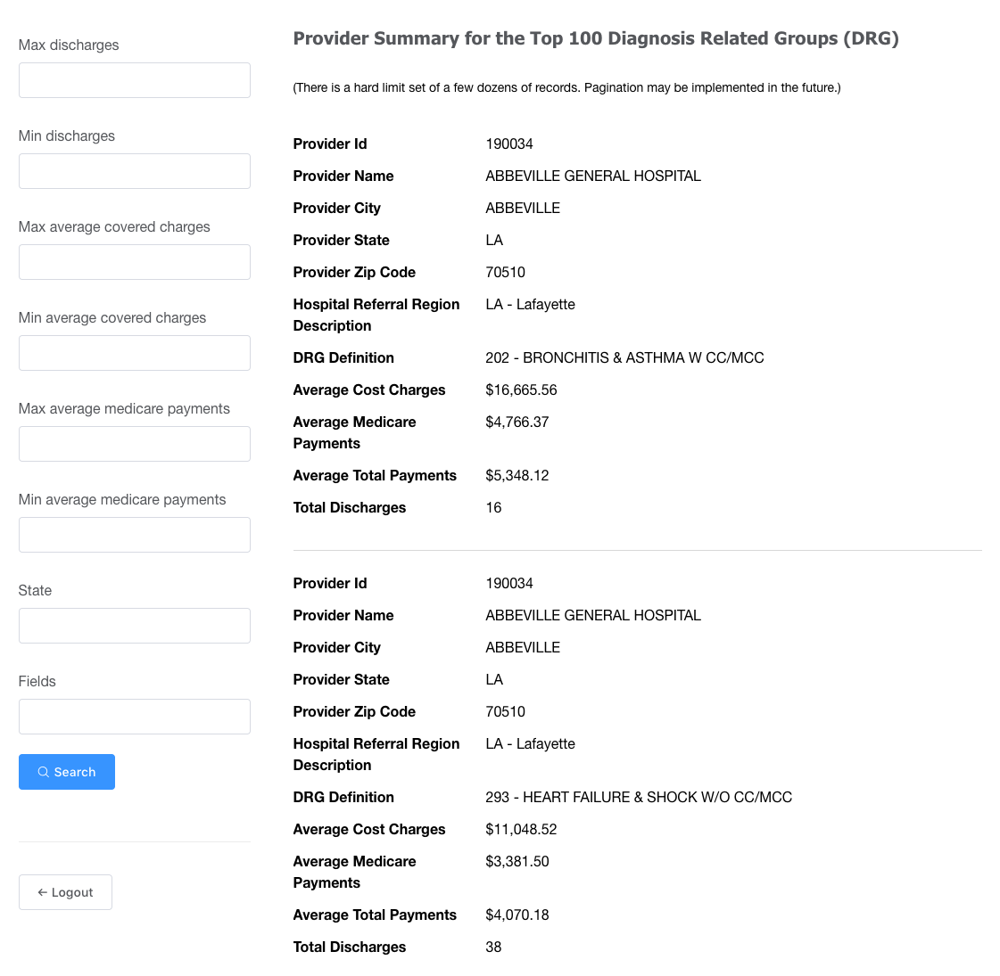
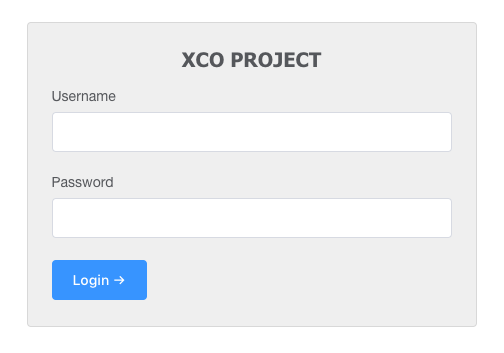

# XCO-APP

> Front-end of the XCO Project

> This APP displays the Provider Summary of the Top 100 Diagnosis Related Groups behind a protected url route.

APP Url: [http://www.xcoproject.com/](http://www.xcoproject.com/)

Credentials:

```bash
username: pablo
password: picasso
```

## Requirements

Before running this project locally, it's required to have the XCO-API project up and running, serving HTTP traffic in the port 3009.

## Build Setup

```bash
# install dependencies
$ yarn install --ignore-engines

# serve with hot reload at localhost:3010
$ yarn start

# build for production and launch server
$ yarn build
$ yarn serve

# generate static project
$ yarn generate
```

## Bonus Features

- Login screen
- Authorization token persisted in the Local Storage and sent in the header of the request for the API
- Filter the fields returned by the API. (_Example:_ provider_name,provider_city,provider_state...)

## Extra Features

- Logout
- The query params in the URL of the page change on every submit of the `Filters` form (without refrshing the page). This allow a shareable url with pre-selected filters
- Pre-fill the filters form with values from the URL query params

## Preview

http://www.xcoproject.com/providers



---

http://www.xcoproject.com/


